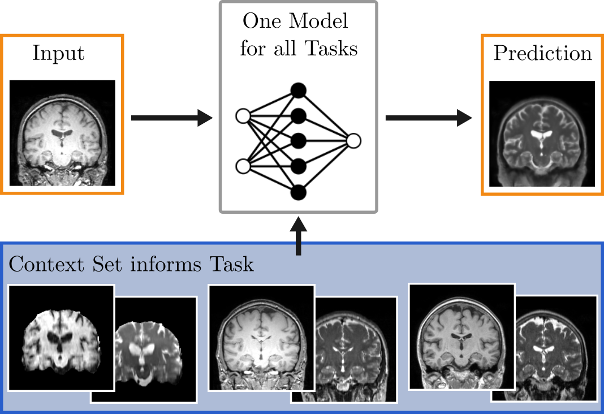

# Neuralizer: General Neuroimage Analysis without Re-Training

Steffen Czolbe, Adrian V. Dalca

Presented at CVPR 2023 [[Video]](https://youtu.be/_wgCESDwjZI) [[Paper]](https://arxiv.org/abs/2305.02644))




Neuralizer solves a broad range of neuroimage processing tasks with a single model by conditioning the prediction on a context set of examples. After training on a diverse set of tasks, the model can generalize to new tasks in a single forward pass without re-training or fine-tuning. The model is highly flexible, requiring no prior definition of the set of tasks, and can be conditioned with context sets of any length.

This repository contains our implementation of the Neuralizer model, the weights of a pre-trained model, and some example images.

## Demo Notebook

We provide an interactive demo in `example.ipynb`. To start the notebook, first install the dependencies in a virtual environment. Set up and activate the enviroment with anaconda or miniconda using:

```bash
conda env create -f conda.yml
conda activate neuralizer_env
```

Depending on the setup of your notebook environment, you might have to install the environment as a ipykernel:

```bash
python -m ipykernel install --user --name=neuralizer_env
```

And finally start the notebook with

```bash
jupyter notebook example.ipynb
```

Again, depending on the setup of your notebook environment, you might have to select the kernel you have just created within the environment, for example in the graphical menu under Kernel > Change kernel.
